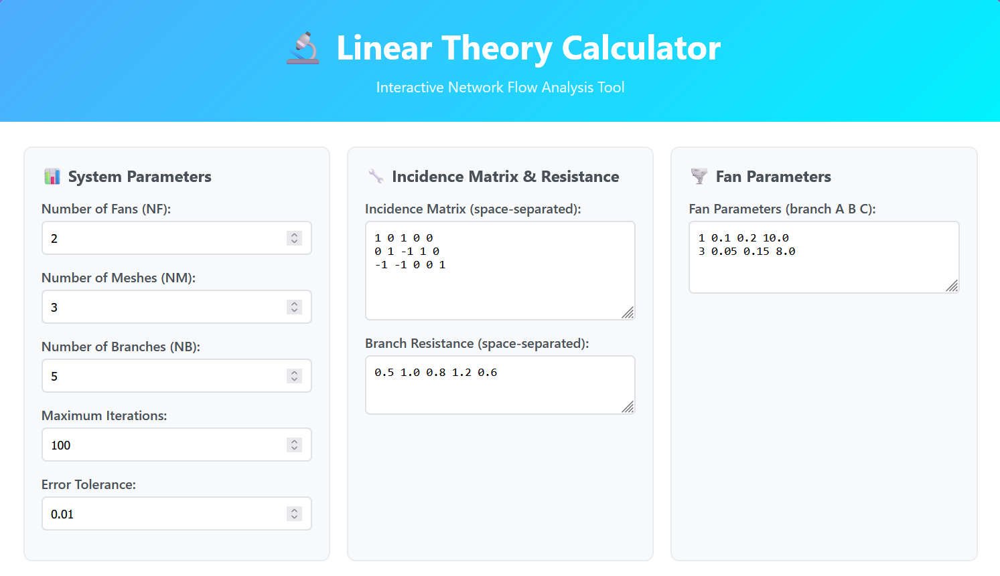
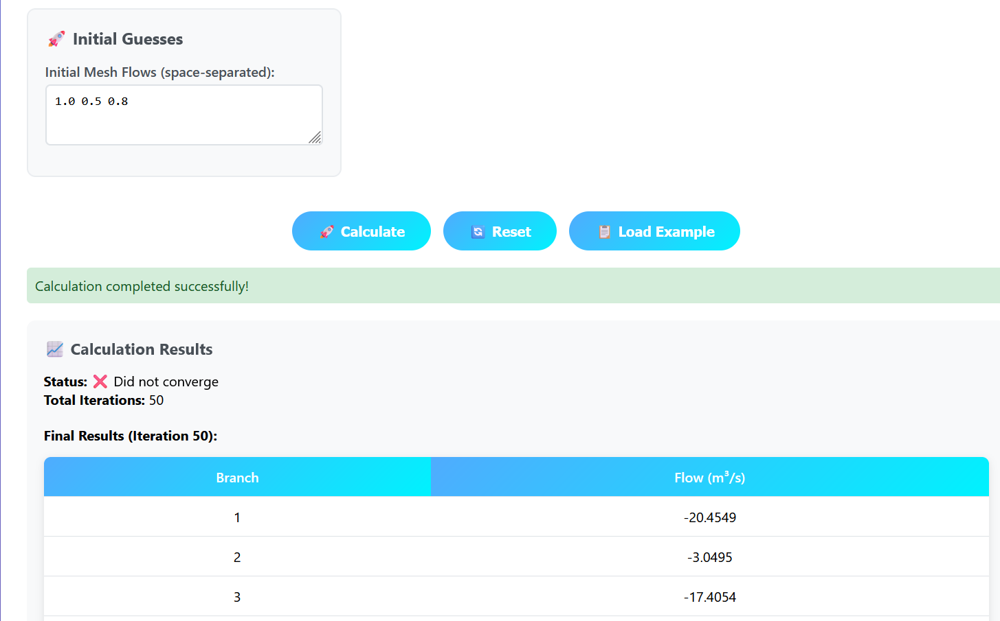

# 🔬 Linear Theory Calculator

A modern, interactive web application for analyzing network flow systems using linear theory algorithms. This tool provides a user-friendly interface for solving complex fluid dynamics problems in network systems with fans and resistances.

## 🌟 Features

- **Interactive Web Interface**: Beautiful, responsive design with real-time calculations
- **Network Flow Analysis**: Solve complex fluid dynamics problems in network systems
- **Fan Integration**: Support for multiple fans with customizable parameters
- **Real-time Iterations**: Visualize convergence process with detailed iteration tables
- **Error Handling**: Robust input validation and error reporting
- **Example Data**: Pre-loaded examples for quick testing
- **Responsive Design**: Works seamlessly on desktop and mobile devices

## 🚀 Live Demo

[View Live Demo](https://princeraj620.github.io/linear-theory-calculator/)

## 📋 Prerequisites

- Modern web browser (Chrome, Firefox, Safari, Edge)
- No additional software installation required
- Works offline after initial load

## 🛠️ Installation

1. **Clone the repository**
   ```bash
   git clone https://github.com/princeraj620/linear-theory-calculator.git
   cd linear-theory-calculator
   ```

2. **Open the application**
   - Simply open `linear theory algorithm.html` in your web browser
   - Or use a local server for better performance:
     ```bash
     # Using Python
     python -m http.server 8000
     
     # Using Node.js
     npx serve .
     
     # Using PHP
     php -S localhost:8000
     ```

3. **Access the application**
   - Navigate to `http://localhost:8000` (if using a server)
   - Or directly open the HTML file in your browser

## 📖 Usage

### 1. System Parameters
- **Number of Fans (NF)**: Total number of fans in the system
- **Number of Meshes (NM)**: Number of independent loops in the network
- **Number of Branches (NB)**: Total number of branches/connections
- **Maximum Iterations**: Maximum number of calculation iterations
- **Error Tolerance**: Convergence criteria for stopping calculations

### 2. Incidence Matrix
Enter the incidence matrix that defines the relationship between meshes and branches. Use space-separated values:
```
1 0 1 0 0
0 1 -1 1 0
-1 -1 0 0 1
```

### 3. Branch Resistance
Enter resistance values for each branch (space-separated):
```
0.5 1.0 0.8 1.2 0.6
```

### 4. Fan Parameters
For each fan, specify: `Branch A B C`
- **Branch**: Branch number where fan is located
- **A, B, C**: Fan characteristic curve coefficients
```
1 0.1 0.2 10.0
3 0.05 0.15 8.0
```

### 5. Initial Guesses
Provide initial flow estimates for each mesh (space-separated):
```
1.0 0.5 0.8
```

## 🔧 Technical Details

### Algorithm
The application implements a linear theory algorithm for solving network flow problems:

1. **Initialization**: Set up initial mesh flows and calculate branch flows
2. **Iteration Loop**:
   - Calculate head losses for each branch
   - Apply fan characteristics where applicable
   - Update mesh flows based on head balance
   - Check convergence criteria
3. **Convergence**: Stop when maximum change in flow is below tolerance

### Mathematical Model
- **Head Loss**: `H = R × Q²` (for regular branches)
- **Fan Head**: `H = A×Q² + B×Q + C` (for fan branches)
- **Flow Balance**: `Σ(A[i][j] × Q[j]) = 0` for each mesh

## 📁 Project Structure

```
linear-theory-calculator/
├── linear theory algorithm.html    # Main application file
├── README.md                       # Project documentation
├── LICENSE                         # MIT License
├── .gitignore                      # Git ignore rules
├── index.html                      # Alternative entry point
└── assets/                         # Additional resources (if any)
    ├── css/
    ├── js/
    └── images/
```

## 🎯 Example Use Cases

1. **HVAC Systems**: Analyze air flow in ventilation networks
2. **Water Distribution**: Model water flow in pipe networks
3. **Industrial Processes**: Optimize fluid flow in manufacturing systems
4. **Research & Education**: Teaching fluid dynamics and network analysis

## 🤝 Contributing

Contributions are welcome! Please feel free to submit a Pull Request. For major changes, please open an issue first to discuss what you would like to change.

### How to Contribute

1. Fork the repository
2. Create a feature branch (`git checkout -b feature/AmazingFeature`)
3. Commit your changes (`git commit -m 'Add some AmazingFeature'`)
4. Push to the branch (`git push origin feature/AmazingFeature`)
5. Open a Pull Request

## 📝 License

This project is licensed under the MIT License - see the [LICENSE](LICENSE) file for details.

## 👨‍💻 Author

**Prince Raj**
- GitHub: [@princeraj620](https://github.com/princeraj620)
- Portfolio: [GitHub Profile](https://github.com/princeraj620)

## 🙏 Acknowledgments

- Inspired by classical fluid dynamics and network analysis principles
- Built with modern web technologies for accessibility and ease of use
- Special thanks to the open-source community for tools and libraries

## 📊 Version History

- **v1.0.0** - Initial release with core functionality
- Interactive web interface
- Linear theory algorithm implementation
- Fan integration support
- Real-time calculation display

## 🔮 Future Enhancements

- [ ] Export results to CSV/Excel
- [ ] 3D visualization of network topology
- [ ] Advanced fan curve modeling
- [ ] Multi-language support
- [ ] Mobile app version
- [ ] API endpoints for programmatic access

## 🖼️ Screenshots

### Main Input Form


### Calculation Results


---

⭐ **Star this repository if you find it helpful!** 